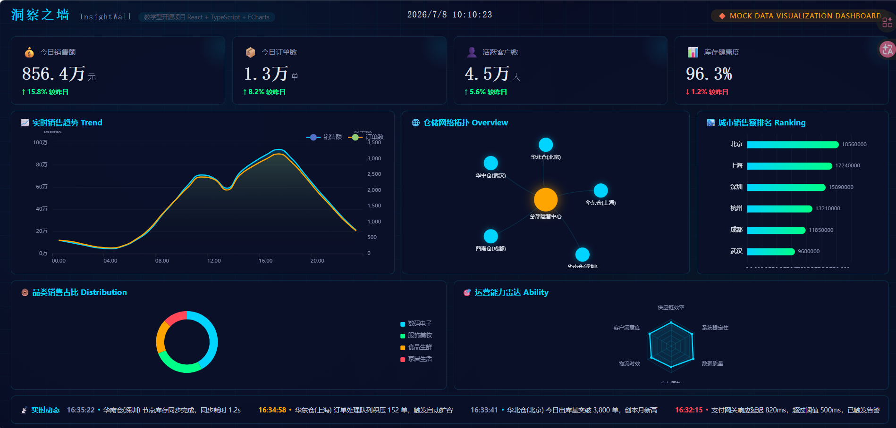

# InsightWall · 洞察之墙

<p align="center">
  
  
  
</p>

<p align="center">
  <em>从 0 到 1，构建你的第一个数据可视化大屏 🚀</em>
</p>

<p align="center">
  
</p>

---

## 📖 项目定位

**InsightWall（洞察之墙）** 是一个面向大学生的开源学习类数据可视化大屏项目。

本项目旨在帮助 **零基础** 的同学，从最基础的概念开始，逐步掌握数据大屏的完整开发流程——涵盖数据获取、数据处理、可视化渲染、大屏布局、交互设计、性能优化等各个环节。

> 🎯 **核心理念**：每一步都讲清楚"为什么这样做"，不堆砌代码，不跳过细节。

## 🖥️ 大屏功能

| 区域 | 内容 | 图表类型 |
|------|------|----------|
| 🔵 顶部标题栏 | 项目名 + 技术栈标签 + 实时时钟 + Mock 标记 | 纯 CSS |
| 📊 KPI 指标卡 | 今日销售额 / 今日订单数 / 活跃客户数 / 库存健康度 | 统计卡片 |
| 📈 实时销售趋势 | 24 小时销售额 + 订单量双轴趋势 | ECharts 折线图 |
| 🌐 仓储网络拓扑 | 总部运营中心 → 5 大区域仓库节点关系 | ECharts 关系图 |
| 🏙️ 城市销售额排名 | 6 城市销售额横向对比 | ECharts 柱状图 |
| 🍩 品类销售占比 | 数码电子 / 服饰美妆 / 食品生鲜 / 家居生活 | ECharts 环形饼图 |
| 🎯 运营能力雷达 | 供应链效率 / 客户满意度 / 物流时效 / 库存周转 / 数据质量 / 系统稳定性 | ECharts 雷达图 |
| 📡 实时动态 | 8 条模拟运维告警日志 | 静态日志栏 |

## 👥 目标用户

- 🎓 计算机/软件/数据科学相关专业的大学生
- 🌱 对数据可视化感兴趣，但不知从何入门的初学者
- 📊 希望在校期间积累一个完整数据大屏项目经验的同学

## 🗺️ 学习路线图

| 阶段 | 主题 | 内容概要 | 状态 |
|------|------|----------|------|
| ① 基础 | 项目初始化与环境搭建 | 工程结构、工具链、开发规范 | ✅ 已完成 |
| ② 数据 | 数据获取与处理 | 适配器模式、Mock 数据、Zustand 状态管理 | ✅ 已完成 |
| ③ 图表 | 核心图表组件 | 折线图、柱状图、饼图、关系图、雷达图 | ✅ 已完成 |
| ④ 布局 | 大屏布局与适配 | CSS Grid 栅格、深色科技风主题 | ✅ 已完成 |
| ⑤ 动效 | 动效与交互 | ECharts 动画控制、入场效果 | ✅ 已完成 |
| ⑥ 实战 | 综合案例 | 电商运营数据大屏完整交付 | ✅ 已完成 |
| ⑦ 进阶 | 性能与部署 | 渲染优化、构建发布、CI/CD | 🔨 进行中 |

## 🚀 快速开始

```bash
# 1. 克隆项目
git clone git@github.com:huifeng-shuqing/InsightWall.git
cd InsightWall

# 2. 安装依赖
npm install

# 3. 启动开发服务器
npm run dev

# 4. 浏览器打开
# http://localhost:5173
```

> 💡 项目默认使用 **Mock 模拟数据**，无需后端即可运行。

## 📁 项目结构

```
InsightWall/
├── 1.png                            # 大屏截图
├── .github/workflows/ci.yml         # CI/CD
├── .husky/                           # Git hooks
├── docs/                             # 架构方案文档 + AI 执行提示词
├── mock-server/fixtures/             # Mock 数据（仿真中文电商数据）
├── public/                           # 静态资源
├── src/
│   ├── api/                          # API 层（适配器模式）
│   │   ├── adapters/                 # MockAdapter / HttpAdapter
│   │   └── modules/                  # dashboard / map / ranking
│   ├── components/                   # 通用组件
│   │   ├── chart/                    # BaseChart / LineChart / BarChart / PieChart / MapChart
│   │   ├── layout/                   # DashboardGrid / DashboardCard
│   │   └── ui/                       # StatCard / PageHeader / Loading / ErrorBoundary
│   ├── pages/                        # 页面（MainLayout 完整大屏）
│   ├── features/                     # 业务模块
│   │   ├── sales-overview/           # 销售概览
│   │   ├── geo-distribution/         # 地理分布
│   │   └── real-time-ranking/        # 实时排行
│   ├── hooks/                        # 全局 Hooks（useScreenAdapt / useIntervalFetch）
│   ├── stores/                       # Zustand 状态管理
│   ├── services/                     # 业务服务层
│   ├── logger/                       # LightLog 日志埋点系统
│   ├── types/                        # TypeScript 类型定义
│   ├── utils/                        # 工具函数（format / color / screen）
│   ├── constants/                    # 常量（API 路径 / 主题色 / 图表默认值）
│   └── styles/                       # 全局样式 + CSS 变量 + 大屏主题
├── tests/                            # 测试（集成 + E2E）
├── .env                              # VITE_MOCK=true
└── package.json
```

## 🛠️ 技术栈

| 类别 | 技术 | 版本 |
|------|------|------|
| 前端框架 | React | 18.x |
| 可视化库 | ECharts | 5.x |
| 状态管理 | Zustand | 5.x |
| 路由 | React Router | 6.x |
| 构建工具 | Vite | 6.x |
| 语言 | TypeScript | 5.x (strict) |
| HTTP | Axios | 1.x |
| 样式 | Tailwind CSS + CSS Modules | 4.x |
| 测试 | Vitest + Testing Library + Playwright | 2.x / 16.x / 1.x |
| 代码质量 | ESLint + Prettier + Husky + Commitlint | latest |

## 🔄 Mock 模式

项目通过**适配器模式**实现 Mock 数据与真实 API 的无缝切换：

```bash
# .env 文件中控制
VITE_MOCK=true    # 使用本地 Mock 数据（默认，无需后端）
VITE_MOCK=false   # 切换到真实 HTTP 后端 API
```

切换后无需修改任何业务代码。详见 [docs/architecture-proposals.md](docs/architecture-proposals.md)。

## 📄 开源协议

本项目基于 **MIT License** 开源。你可以自由地：

- ✅ 学习、复制、修改代码
- ✅ 用于个人项目或课程作业
- ✅ 用于商业项目
- ✅ 分发和再发布

前提是保留原始版权声明。完整协议文本见 [LICENSE](LICENSE)。

---

## 🤝 贡献

- 💡 **提 Issue**：建议学习内容、分享学习资源
- ⭐ **Star 项目**：鼓励作者持续更新
- 👀 **Watch 项目**：第一时间获取内容推送
- 📢 **分享给同学**：让更多人一起学习

---

<p align="center">
  <strong>🌟 如果这个项目对你有帮助，请给一个 Star 鼓励一下！</strong>
</p>